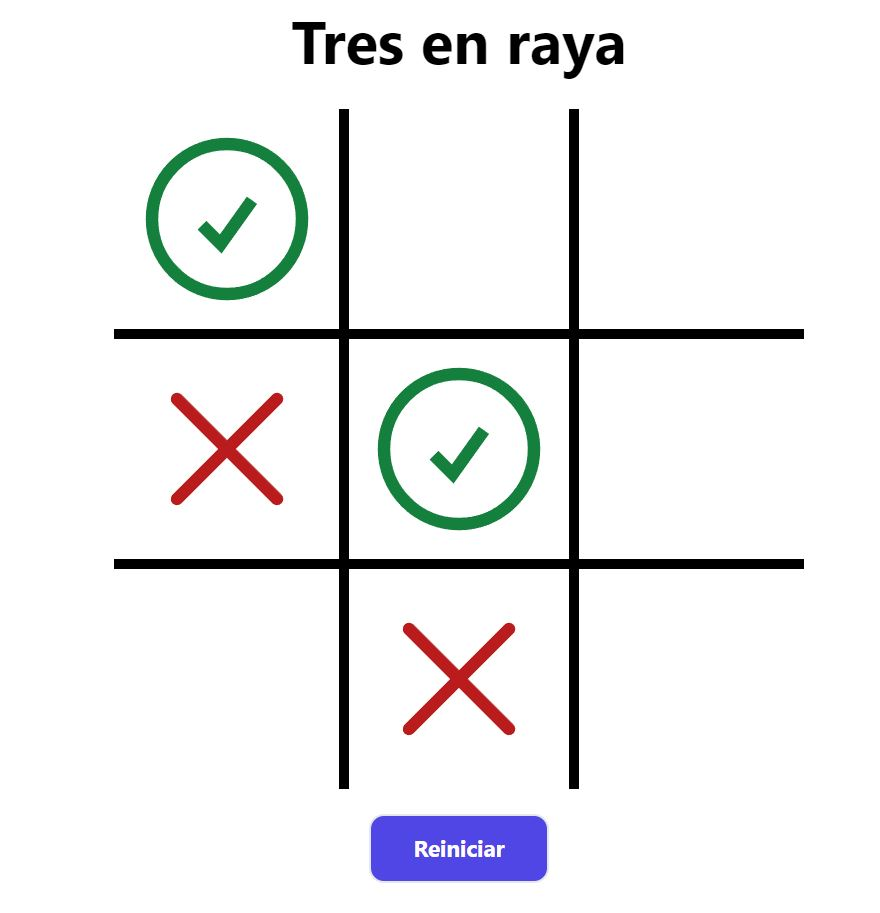
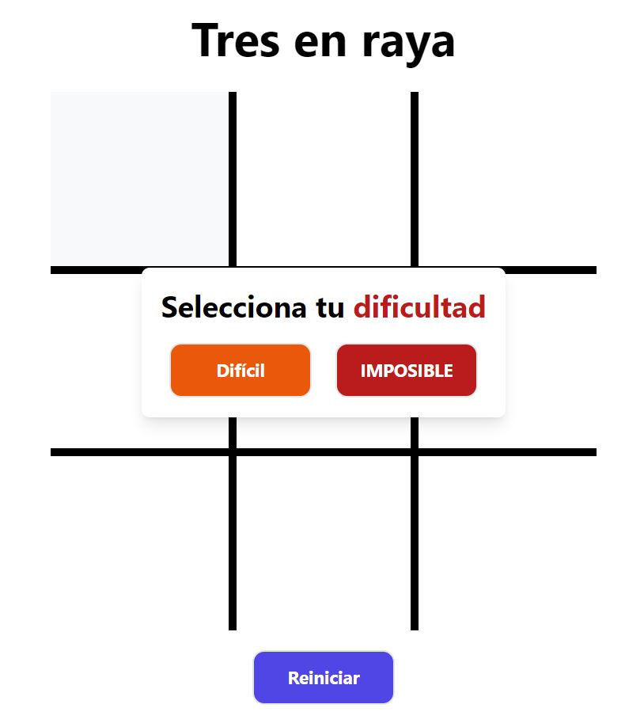

# Bot Tres en Raya


Un bot que juega contra ti en el **tres en raya** programado por medio de algoritmos que calculan la mejor jugada posible según el contexto de la partida. 
Proyecto desarrollado con VUE 🟢, con gestor de estado PINIA, estilado con TAILWIND 🔵 y testeado con VITEST. 

<div style="display:flex; justify-content:center; margin-bottom:30px">
    
</div>


## 🔨 Funcionalidades del Tres en Raya
<div style="display:flex; justify-content:space-between; margin-bottom:20px; align-items:start">
    <ul>
        <li> Jugar contra otro <strong>jugador</strong </li>
        <li> Jugar contra el Bot</li>
        <li> Escoger la dificultad del bot <strong>(Díficil e Imposible) </strong> </li>
        <li> Reiniciar la partida una vez termine</li>
    </ul>
    
</div>

---

## Entorno recomendado para ejecutar el proyecto

IDE: [Visual Studio Code](https://code.visualstudio.com/)  
Con la extensión: [Volar](https://marketplace.visualstudio.com/items?itemName=Vue.volar)

---

## Comandos para levantar el proyecto en tu máquina

### Instalar dependencias
🔥 VUE, Tailwind y Vitests 🔥

```sh
npm install
```

### Levantar el servidor en local

```sh
npm run dev
```

### Compilar y unificar para producción

```sh
npm run build
```

### Correr los test

```sh
npm run test
```
